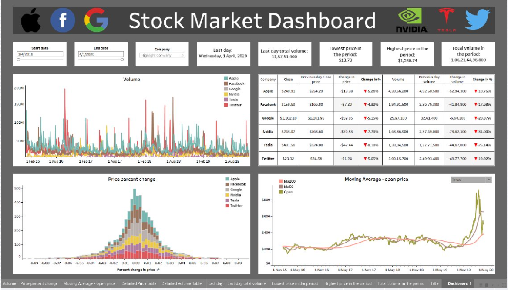

# Stock Market Dashboard

## Project Overview
The Stock Market Dashboard project is designed to provide a comprehensive and interactive visualization of stock market data. Created using Tableau, this dashboard allows users to analyze stock performance, track market trends, and make informed investment decisions through intuitive visualizations and interactive features.

## Problem Statement
In the dynamic world of stock trading, having access to real-time and historical data is crucial for making informed investment decisions. Investors and analysts need a tool that offers an easy-to-understand visualization of stock market trends and key performance indicators. The goal of this project is to develop a dashboard that presents stock market data in a visually appealing and interactive format, enabling users to monitor and analyze stock performance effectively.

## Business Goal
The primary objective of the Stock Market Dashboard is to create a user-friendly tool that helps investors and analysts:
1. Track the performance of individual stocks and market indices.
2. Identify trends and patterns in stock prices over time.
3. Compare the performance of different stocks and sectors.
4. Make data-driven investment decisions based on visual insights.

## Features
The dashboard includes the following features:
- **Real-Time Data Visualization:** Live updates of stock prices and market trends.
- **Historical Data Analysis:** View historical performance of stocks and indices over various time periods.
- **Performance Metrics:** Key metrics such as price changes, volume, and market capitalization.
- **Comparative Analysis:** Compare the performance of multiple stocks or indices side by side.
- **Interactive Filters:** Filter data by date range, stock symbol, sector, and more for customized views.
- 
## Dashboard Screenshot
Here is a preview of the Stock Market Dashboard:

## Dataset
The dashboard utilizes a dataset that includes various stock market metrics, such as:
- **Stock Symbols:** Identifiers for individual stocks.
- **Dates:** Timestamps for each data point.
- **Open Price:** The price of the stock at the opening of the trading day.
- **Close Price:** The price of the stock at the close of the trading day.
- **High Price:** The highest price of the stock during the trading day.
- **Low Price:** The lowest price of the stock during the trading day.
- **Volume:** The number of shares traded.

## Installation and Setup
To use the Stock Market Dashboard, follow these steps:

1. **Download Tableau:** Ensure you have Tableau Desktop or Tableau Public installed. You can download Tableau from the [official website](https://www.tableau.com/).
2. **Open the Dashboard File:** Open the Tableau workbook file (`.twbx`) in Tableau.
3. **Connect to Data:** Ensure the dataset is connected to the dashboard. Update the data source if necessary.
4. **Interact with the Dashboard:** Explore the various features and visualizations within the Tableau dashboard.

## Usage
To interact with the dashboard:
1. **Navigate Through Tabs:** Use the tabs to switch between different views and analyses.
2. **Apply Filters:** Use the interactive filters to customize the displayed data.
3. **Analyze Trends:** Review the visualizations to identify trends and make data-driven decisions.

## Contributing
Contributions to this project are welcome! Please open an issue or submit a pull request for any improvements or bug fixes. 

